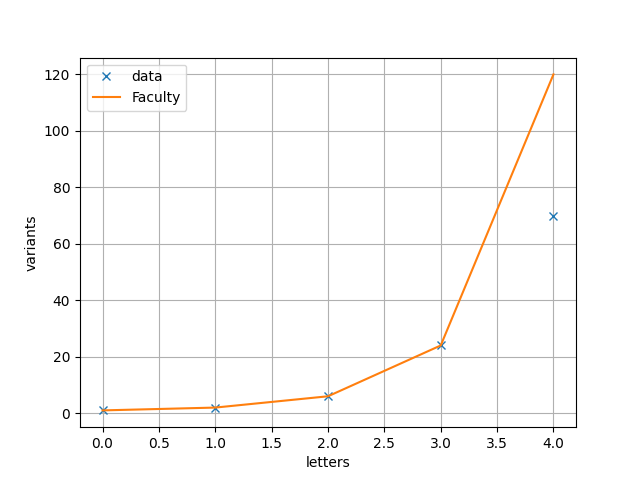

# Scrambled: RSA

## Description
Hmmm I wonder if you have learned your lesson... Let's see if you understand RSA and how the encryption works. Connect with nc mercury.picoctf.net 58251.

## Hints
- Look at the ciphertext, anything fishy, maybe a little bit long?
- What happens if you encrypt the same input multiple times?
- Is RSA deterministic, why would outputs vary?

## Solution
Connecting to the server we get:
```
flag: 17395117455719232403895760574761957916693298100725313213453747257860147432591080917625551180738760332468238677948569126093509877945165955382938165184877889308752869879799401977432166101139494615751675373026439643816308790307923613414770833614267410140527300729019906142930600314155132683288856192408887592159575791140231927624475289194603524940930675656669790029012137557342423126231170648082200319863061522656701628000748453011622040098300006704578304128044511719702749967964546331719905797144364433662545783759160397069329217310742347505325691297175701912934360290586325953497049734220054133545662343984591416896912414468621519712497693363834782220672703643744653913965928937463576410879254829088571534456250253868895465586215189304078125376497504005509975503446853065989912135655900265487262652899077666712982961560986893251377457449651418975121704371950271525513956203994159610172623496121555405558731514519431572217153737533711588703069466353494607451933073054749482954327869510083986503817552110066073940619151632798313741562133598328435383601059582189086143928473101013696312323775938531582136229380491487216256392768658853147684682655011290066428114118885247006150203645407000934512471668159636422579847680643295696919439410302630942420131042773435266754201227878910008838232595705868807313952334722415384388177381874404681248831817032220472128130191659040327380275464782754745763653725189295594312964783065577551492633650694401742278301716946793985896839209184419354166203448362483889182509584028314810123650184500385208394244423751270869873838820508546454523141201509073105409319533065578855555115982382401849663826500953543769647710346673512444090727059232137728848264060068927083676738182241886247331650151205531263848104846382130629003406973629136148870045320188318102100171627561961878513060765360551599092724723841239361863430803423013355687816581399009052534310646422448039259461482224725571197319661520250356268207940412743717436360638528165606673034266379993921615130315092213642384369671835052452313470283325936303475178400071436044279247583299383048519116616550069592332788170880838214891815749424542624344259764136871330674719841666497770105672303871563551729246163048101143324934653044885634702368930156045979201908839632311348770597306633472746121273068360452194047370970571626670571919036048814225709791317630363250361898761842897796983792237402047675172752213407273094825605727539856946089618652381596073977657678409439418847072777424010212917969646278721609767083316772798157277917538549304270291870880599825221523774203183312769730994799024325535485433193942913283695268691175043975389157921661451564362137729959975276211690880960201180162514830815244012322066636096900459571915441128019337723008132309339515018849280284578746417677230301504015278372869175762639352082098806413888983297881316507187011760027233064675576902987442591794765062733853474371049014876978355437023419896479542146653057377730962369305164408450752072208787449264020549862765885656630026935098082740104421384755084905749900919030180979418178752518132103190058036156383662645024247328201390370115022253363261569237326553736752723432931645191565712652022805933164291850744436594446790645003917343817956115139991700101111572522734551870921885013439594276845537984969943107215456015995127734044744405096380705697719014556722081391282842957180077470037477181892325765277358867725125748055454599945189801385550280910008779982360296039143101268107625667255641595261976791981027567098673371796105111088408566282849379049631852325285164114663585685281770400693179910799429868815462471587134749766699148238650353605085827193202731653662310810752539465647922098106189808782691563052575692565956817037143157446905243622495783327939191810404023301719126682161384134248701048693343130381662333817104888500638238291122924301960789268523042419575525370693453043030818887179995703746283744255515428423847908493014084792938961758284966182643258914667042616328816492549276200762339439680494338945897647436277509319963818684975169409342242447966172943582280198232485110762997818307747974219493409699993230962819466040195358833862997477233752216884885861025956409707350639806079498604875243441184331246705698662884632056114099392589232266938497312448809053469588853450208511882348054207130384631882598310034487654290904507205102615427343966111386514736852981832497083350139787409527024377583756499711609773637965094089643929745084347044445843252462779443653427821696547671648948949353049308908348392511481652348604282432980610980408858084185757027867245829910400119971216760138251134364043452918040935246195561512746592179625130346438979555787858275641190290890620192853391973172306624451303823115243597269362028269677415023155496297022723172030236856514572606924747226137174534706043002452489725864286642296741908892382628026680091345151641538923990558792969906326946503928614607971425727572339609088862510236608251957345591198092160567567535716446159959696189947079646644951650029225569211609810997034110757567229504770126373990244569606326862343030932122049378724118426920076541047335802842534019692040310928529323735836589195253917292382113013292740982620659142647125467123666838771008890879717805277308388904832578291484874958761784054639705912797755846721156998756326454554700305270781553335969924590664935694853111771548852382032637898611877862788391551288510282527363006471433757754956600837318876271707741582380241710635465146050069114618529796733661693472666903097430376873341389234803251943850128419901812148022441120088440605042633408523331781355954459199569431291475640662830420740674746447809189054354947405537737334283921495569291326318376256947968440730624183899487738612968918357382214428617384926301329231970347898964843085058753881156092966803115715941042023783607978173234921669420175864861999716357105376894904611597663304542584874304081932550387823023937157273532100913216440997225189295359301905975012931187727163166882682462974847173972052719722273407733449908881178425084029628458466205838840267931616633788315407787900934464056807703287245710563016999815077171967895989571841402355346258345911411597004887150641010669520713620196530789995588564885892639683650258955146515057252684172209622011927568298017586568968632402752592236882450522939370842913064105532537485400223904801017910938627015770553667304160210714927494027744012342673092677461469896118486310528234752075120534659678026682492354435290499538027839121260472922046196430050060625175592409327906568566073387990119815454631938196980567461986155879171312756058785232843978720624864705831377353229059532591860672605591802429981699199415255116101483370462448966128300379395417277841055152930408912128610368240095551782423057077530876701129395786434699243864958313208474613942413308054569967198990388322539810058532293729875717940114810396411055713224888276921115796295006872761856229613651505380415201824760123523381456881189889738229492905163773522052307423228651975269974477560396727090240063935779853329050827382902677030023316833922707974825467605033863600557192633192554509545561195462533375713110176164577798656703575735979553887334405861381717578594997882267473709752942629597826530910610799132334548938077672563367083421448441897084615792930014020538223236579528199956976542444510081289070051011942570737549005436947277603295887121281906036062757376508742089181642555156929768815291746835775928575580644563381719978223593733903841023948185416733391873112801531815212137653730626311697231488933011802033178748793050596983180216057551379036792338454368094688298173368899089741024348933989460028401385994422119348143880390679852516139032220498695830316752492093637381631026002604734101501282246107100496930313365102472257497725359225011684602018030831141530638423313406973624999569429379497225915784508940642159995163705226518437366835095808179005099187283365212191122739125250328570181089276995328694963387243050531331047605398587189260618414841030607241103496966307137791677030891489658561994906506043889377411907904330969524900834605
n: 79196702013959821590140208540392697122438627176557529701504866498886495474748542617456474306129907459763986553992946671837606264278957941774742360137394007262464747282834073356473378624703247896862087801613646134099357477177912303143783146826071791159521245102387475209314412840147845908656776737131998252069
e: 65537
```

At first, we analyse the different outputs. 
As the hint suggests we encrypt the values multiple times. 
In doing so we notice that the encryption of a single letter always returns the same.
When we encrypt two letters multiple times we get different hashes. 
We then use the `analyse.py` to get some statistics for the hashes.

The number of variants grows with the faculty. 
The last dot for 5 letters does not fit into this plot. This is easy to explain.
Since we took only 100 random samples chances are good, we did not get all of them. 
Especially, since all of them would mean 120 variants...


This indicates that the variants may be permutations.
In fact, the strings obtained for a given number of letters are all the same length.
Unfortunately, shows the difference measurement that the length does not increase constantly.
Thus, we conclude that `permutation(crypt("a"), crypt("b")) != crypt("ab")` but since
`crypt("a") in crypt("ab")` and `crypt("ab").remove(crypt("a")) in crypt("abc")` we can simply test us forward.

This is realized in the `main.py`. The flag reads:

```picoCTF{bad_1d3a5_1314164}```


