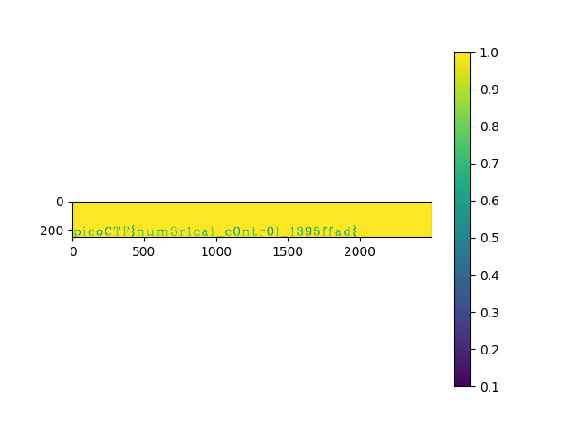

# speeds and feeds

## Description
There is something on my shop network running at nc mercury.picoctf.net 16524, but I can't tell what it is. Can you?

## Hints
What language does a CNC machine use?

## Solution
Connecting to the server we get a set of instructions.
As the Hint suggests these instructions are G-code. 
We save them into the instructs.txt file and write a simple python script to
simulate a CNC.

G-Code is explaind in this article:
https://en.wikipedia.org/wiki/G-code

The first line is:
```G17 G21 G40 G90 G64 P0.003 F50```
which holds the relevant information:
```
G17: xy plane
G21: using mm
G90: Absolut positioning
```
We than write a simple script `main.py` which interprets this code (only G0 and G1 necessary).
This reveals the flag:


